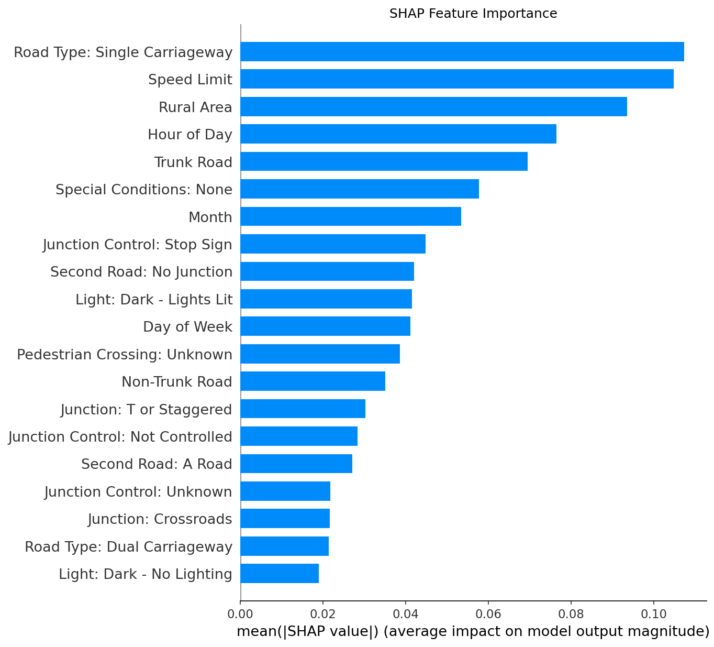

# Road Collision Severity Predictor

**Live demo:** _coming soon_

An interactive Streamlit app that estimates the probability that a road collision in Great Britain results in a **serious or fatal** outcome, based on road, lighting, weather and time conditions. A class-weighted XGBoost model, trained on 500,000+ UK Department for Transport STATS19 collision records (2020–2024), makes the prediction. SHAP explains each individual prediction.

Built as the major project for my Higher Diploma in Data Analytics.

## Features

- **Risk Predictor**: choose the road and conditions to get a risk gauge against the model's tuned decision threshold, plus a SHAP waterfall chart explaining that specific prediction.
- **Dataset Overview**: key statistics, the class imbalance, and serious/fatal rates by the model's top predictors.
- **SHAP Explorer**: global feature importance, and the direction of effect across the test set.



## Tech stack

Python · XGBoost · scikit-learn · SHAP · pandas · Plotly · Matplotlib · Streamlit

## Data

UK Department for Transport [STATS19 road safety data](https://www.data.gov.uk/dataset/cb7ae6f0-4be6-4935-9277-47e5ce24a11f/road-accidents-safety-data), Great Britain, 2020–2024. `data/dataset_slim.csv` is a trimmed copy containing only the columns the app's Dataset Overview tab uses.

## Run locally

```bash
python -m venv .venv
source .venv/bin/activate
pip install -r requirements.txt
streamlit run app/app.py
```
